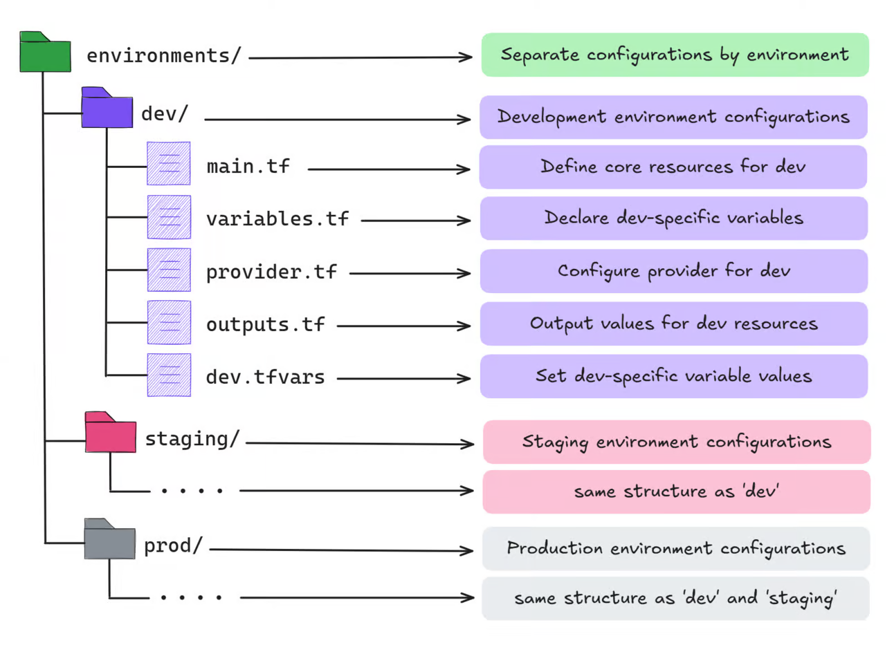
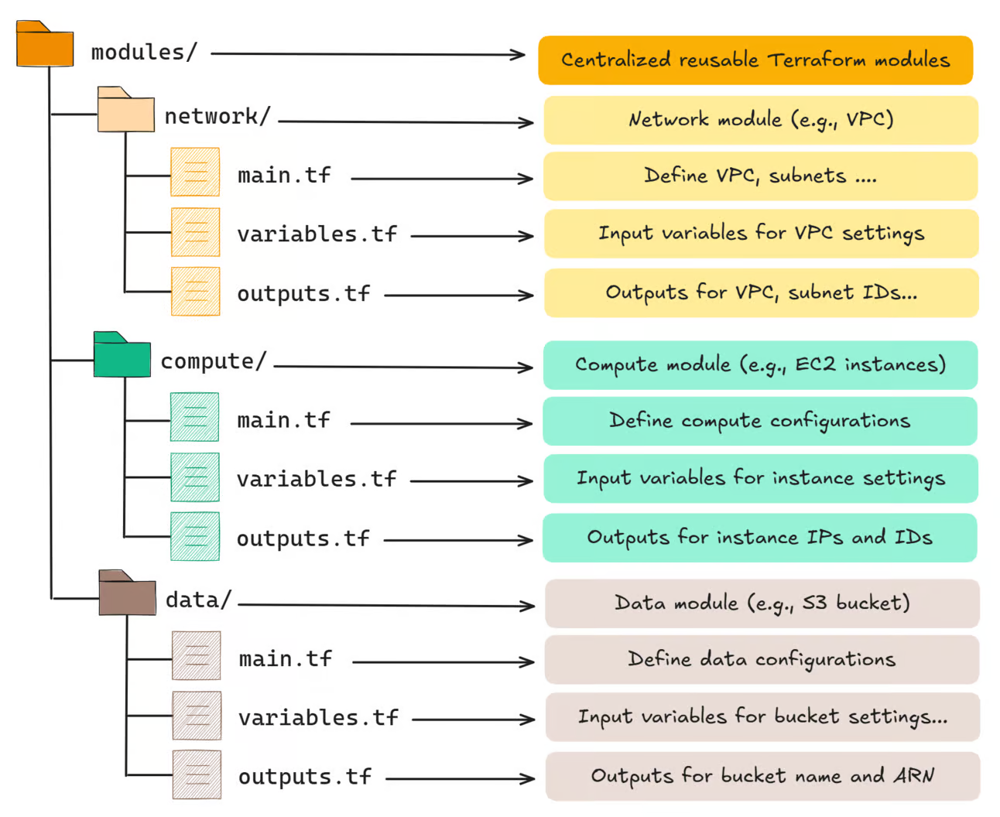

# Terraform Environment Directory Structure

**Source & Credits**: Notes are based on insights from the [TechOpsExamples Newsletter - Environment Directory Structure](https://www.techopsexamples.com/p/guide-to-a-well-structured-terraform-project)

## Overview

This note covers best practices for structuring your environment directories in Terraform, as outlined in the TechOpsExamples newsletter. Following a clear directory structure is crucial for maintaining organized, scalable Terraform configurations, especially when working with multiple environments (e.g., dev, staging, production).

## Recommended Directory Structure

A typical structure suggested for managing multiple environments in Terraform might look like this:

Why Structure Matters: Organizing Terraform projects helps scale effectively, supports team collaboration, and enhances security.

Layered Setup: Use separate directories for each environment (e.g., development, staging, production), ensuring isolated and organized configurations.

Centralized Modules: Store reusable modules in a central repository. Each environment references specific versions, promoting consistency and controlled updates across projects.

This structure keeps everything manageable, version-controlled, and adaptable as the project grows.

**main.tf:**
Defines core resources for the environment by referencing modules from the central repository. Each module is tagged to ensure a specific version is used.

**variables.tf:**
Declares input variables, making the configuration adaptable. For example, instance_type might vary between environments (e.g., t2.micro in dev, t3.large in prod).

**provider.tf:**
Configures the cloud provider and backend for remote state storage, which tracks deployed resources. This setup is crucial for collaborative workflows.

**outputs.tf:**
Defines output values, making it easy to retrieve information, like IP addresses or resource IDs, after deployment.

**dev.tfvars (Environment-Specific Variables):**
Contains values for variables declared in variables. tf, tailored to this environment. Each environment (dev, staging, prod) will have its own .tfvars file.

Setting up a centralized modules repository in Terraform:

**Organize by Type:** Use folders for different types of modules (e.g., network, compute) within a central repository.

**Version Control:** Use specific version tags for each module to keep configurations stable and manageable.

**Best Practices:**
- Centralize modules in a remote repository for consistent usage across projects.
- Prioritize reusability by refactoring modules as projects expand.
- Use variables instead of hardcoded values for flexibility.
- Maintain focused, single-purpose modules with clear input/output definitions.
- Include README documentation and conduct independent testing for each module.
- With this approach, teams can confidently manage and deploy resources in multiple environments.